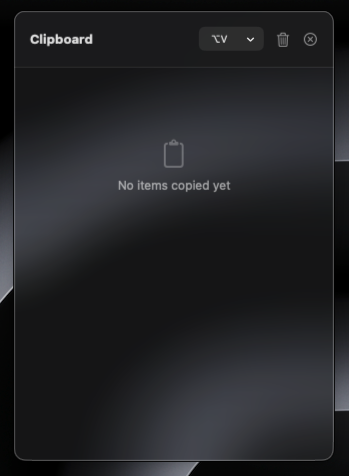
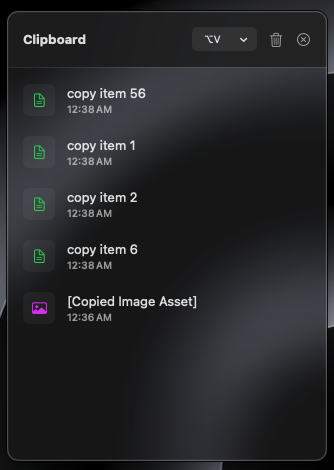
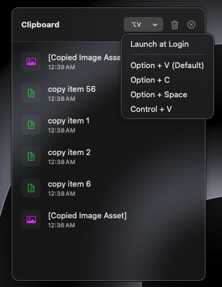

# ClipboardManager

A lightweight and fast native macOS clipboard manager built with Swift.

## Features
- 📋 Open the window where cursor point exactly
- 📋 Automatically saves clipboard history
- 🔍 Quickly search copied items - (will be added in next version)
- ⚡ Lightweight and fast
- 🖥 Native macOS application
- 🔒 Runs locally without sending your data anywhere

---

## Screenshots

### Main Window

### Clipboard History

### Clipboard Settings

---

## Installation

1. Download **ClipboardManager.dmg** from the Releases page.
2. Open the DMG.
3. Drag **ClipboardManager.app** into the Applications folder.
4. Launch the app.

### First Launch

Since this application is not signed with an Apple Developer certificate, macOS may display a warning.

To open it:

- Right-click the application.
- Click **Open**.
- Click **Open** again.

After the first launch, the warning will not appear again.

### How To Use
after launch the tool from Launch pad press OptionKey + V

---

## Requirements

- macOS 14.6 or later

---

## Built With

- Swift
- SwiftUI
- Xcode

---

## Download

Download the latest version from the **Releases** section.

---

## Roadmap

- [ ] Don't need Menu bar or Doc Item
- [ ] Favorites
- [ ] Cloud sync
- [ ] Keyboard shortcuts
- [ ] Dark mode improvements

---

## Contributing

Contributions are welcome.

Please open an Issue or submit a Pull Request.

---

## License

MIT License